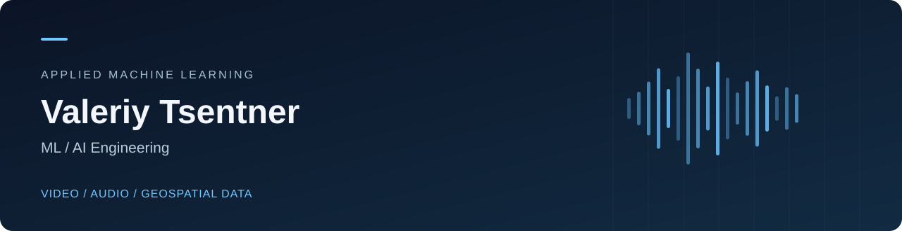

  

  
  
  
  

## Валерий Центнер

Разрабатываю ML/AI-приложения для видеоаналитики, обработки аудио и геоданных. Работаю с локальным инференсом, мультимодальными моделями, оценкой качества и Python-сервисами. Учусь на прикладной информатике в МИИГАиК.

### Избранные проекты

| Проект | Задача | Технологии |
| :--- | :--- | :--- |
| **[VideoScope](https://github.com/guguker/VideoScope)** | Мультимодальный поиск по видео и детальный разбор баскетбольных эпизодов: интервалы, подтверждающие кадры, разметка и MP4-нарезки | PyTorch · MLX · Qwen · SigLIP · FastAPI · Qdrant |
| **[GeoPredict](https://github.com/guguker/GeoPredict)** | Геоаналитический прототип ранжирования городских локаций с собственным бустингом на NumPy | NumPy · pandas · H3 · OpenStreetMap · FastAPI |
| **[Voice Emotion Analyzer](https://github.com/guguker/Voice-Emotion-Analyzer)** | Оконный анализ эмоций по голосу на предобученной wav2vec2 с desktop-интерфейсом | PyTorch · Transformers · librosa · CustomTkinter |
| **[ML Cards](https://github.com/guguker/ML-Cards)** | Учебное PWA: карточки по ML, интервальное повторение, импорт материалов и экспорт в Anki | Python · JavaScript · PWA |

### Что мне интересно

- Computer Vision и мультимодальный поиск: от длинного видео к конкретному эпизоду.
- Локальные ML-системы: подготовка данных, инференс и интеграция в приложение.
- Оценка моделей: воспроизводимые эксперименты, сравнение с baseline и разбор ошибок.

В README каждого проекта описаны устройство, запуск и текущие ограничения. VideoScope и голосовой анализ используют готовые модели; GeoPredict пока работает с синтетической целевой переменной.

**Связаться:** [@guguskk в Telegram](https://t.me/guguskk).
